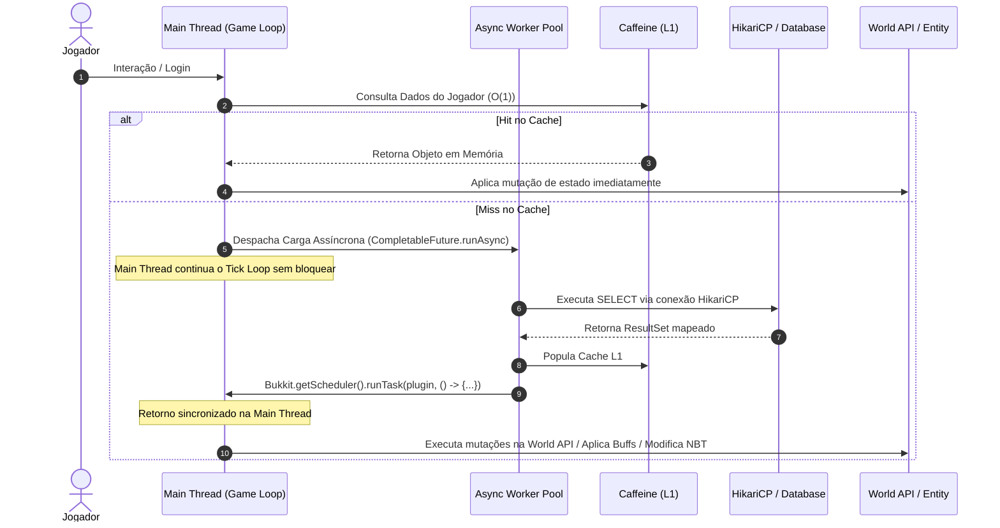

# 02. Concorrência e Modelo de Threading

## 1. O Ciclo de 50ms (20 TPS)
O PaperMC opera em um modelo síncrono cooperativo:
- **Tick Budget**: `50.0 ms`.
- **Frequência**: 20 TPS (*Ticks Per Second*).
- **Alocação de Tempo Típica**:
  - `0 - 15ms`: Processamento de entidades e tick de blocos.
  - `15 - 30ms`: Processamento de rede e pacotes pendentes.
  - `30 - 45ms`: Plugin logic síncrona e execuções agendadas (`runTask`).
  - `45 - 50ms`: Folga (*headroom*) para absorver picos. Ultrapassar 50ms acarreta **Tick Loop Lag** e queda proporcional de TPS.

## 2. Proibição Estrita de I/O na Main Thread
Operações bloqueantes são proibidas na Main Thread:
- Conexões JDBC / Queries SQL.
- Leitura e escrita em disco (exceto via I/O nativo assíncrono de chunks do Paper).
- Chamadas HTTP / REST APIs.
- Bloqueios explícitos (`Thread.sleep()`, chamadas blocking em `CompletableFuture`).

## 3. Sequência de Mutação de Estado Seguro

## 4. Regras Operacionais para Prevenção de Lag
1. **Thread-Safety da World API**: `org.bukkit.World` e manipulações de entidades/blocos não são thread-safe. Nunca altere estado de jogo dentro de threads assíncronas.
2. **Offloading Proativo**: Serialização (JSON/NBT) e computação intensiva devem ser resolvidas no worker pool assíncrono antes da entrega à Main Thread.
3. **Backpressure**: Ao atingir capacidade máxima na fila assíncrona, descarte ou aplique throttling com log explícito em vez de rebaixar a execução para a Main Thread.
