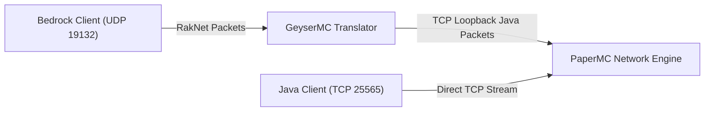

# 03. Crossplay: GeyserMC e Floodgate

## 1. Topologia de Protocolos de Rede
A ponte de crossplay unifica dois protocolos de transporte distintos:
- **Bedrock Edition**: Protocolo binário baseado em UDP utilizando RakNet framing (porta padrão `19132`).
- **Java Edition**: Protocolo TCP orientado a streams com framing delimitado por VarInt (porta padrão `25565`).

## 2. Autenticação e Floodgate
O Floodgate viabiliza acesso Bedrock seguro sem exigir aquisição duplicada da edição Java.

### 2.1 Criptografia Assimétrica
- O ambiente gera um par de chaves ECDSA/RSA (`key.pem` e `public-key.pem`).
- Geyser assina digitalmente a carga útil de handshake com a chave privada após validação via Xbox Live.
- Floodgate no PaperMC decodifica e valida a assinatura usando a chave pública pareada antes de aprovar a sessão.
- Previne ataques de spoofing de conexões diretas na camada de transporte.

### 2.2 UUIDs Determinísticos
- Clientes Bedrock não possuem UUID oficial emitido pela Mojang.
- O Floodgate deriva um UUID v4 determinístico calculado via bitwise a partir do XUID (Xbox User ID).
- Os primeiros 16 dígitos hexadecimais recebem o prefixo fixo `00000000-0000-0000`, seguido pelos bytes derivados do XUID.
- O UUID gerado é invariável em trocas de servidor, reinicializações e clusters, mantendo integridade em bancos relacionais.

## 3. Matriz de Compatibilidade e Mecânicas de Gameplay
| Mecânica | Edição Java | Edição Bedrock | Tratamento na Infraestrutura |
| :--- | :--- | :--- | :--- |
| **Combate** | Cooldown de ataque (1.9+) | Spam-click sem delay | Geyser simula cooldown via animações visuais |
| **Redstone** | Quasi-conectividade e ordem determinística | Sem quasi-conectividade e aleatoriedade de ticks | Servidor executa regras estritas do PaperMC |
| **Offhand** | Aceita qualquer item | Restrito a escudo, tocha, mapa | Geyser adapta inventário via formulários nativos |
| **World Height** | Altura -64 até 319 | Altura -64 até 319 | Compatibilidade nativa direta |
